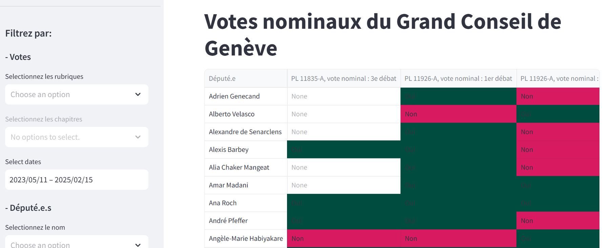

# Votes nominaux du Grand Conseil de Genève
This application aims to provide access to the nominal votes from Grand Conseil de Genève. You can access the application [here](https://votes-nominaux-geneve.streamlit.app/).



It was developped in Python with streamlit.

## Installation
```
pip install -r requirements.txt
streamlit run app.py
```

If you want to run the docker image

```
docker build -t gc_geneve_votes .
docker run --name gc_geneve_votes -d -p 8080:8501 gc_geneve_votes
```
## Description
The purpose of this application is to filter the personal votes of the members of Geneva's Grand Conseil. It allows you to filter affairs by:

- Headings and chapters of the Geneva Systematic Register,
- Types of voting,
- Title of the voting,
- Name of the deputy,
- Political party of the deputies,
- Gender of deputies

The database was retrieved using the Open Parl Data project. The application covers votes for the current legislature (2023-2028), from 11 May 2023 to 15 February 2025 (the latest date for data import).

- 82 votings with a reference to Registre Systématique genevois and 319 other votings
- 125 deputies
- 35’455 nominal votes

Source: 
- [OpenParlData](https://gitlab.com/opendata.ch/openparldatach)
- [SILGENEVE PUBLIC](https://silgeneve.ch/legis/)

##  Contacts
[Yann Say](https://www.linkedin.com/in/yannsay/)

## 
This application was developped during the course "Python Software Engineering" with Nomades, March 2025.


